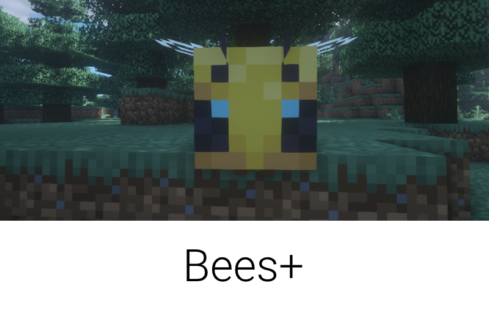
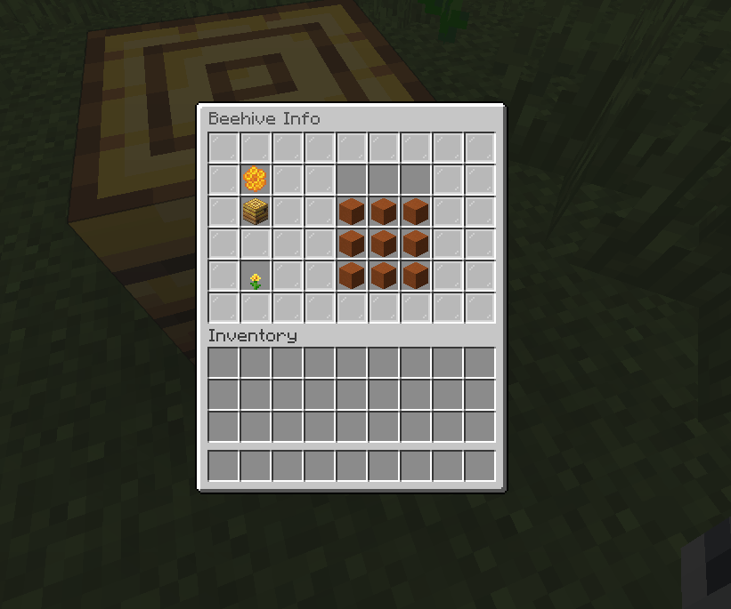
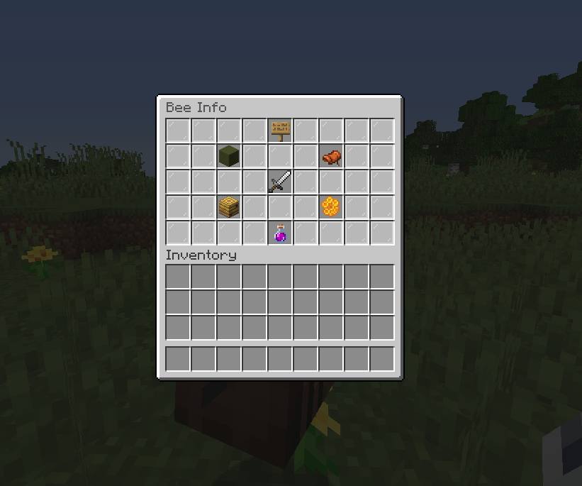

    

A Spigot (Minecraft server software) plugin that displays useful bee-related information.

## Compatibiliy
This plugin is only compatible with Minecraft 1.15+ currently.

## Demo

    

    

## Builds
The latest plugin builds can be found in it's SpigotMC Forum's page [here](https://www.spigotmc.org/resources/beesplus.77224/).
You can also clone this repository and build the plugin with Maven.
Please note that this projects depends on `spigot` and not `spigot-api` 

## Metrics

    

